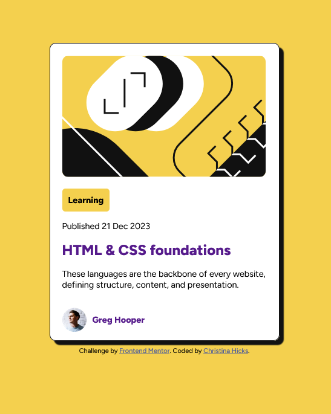
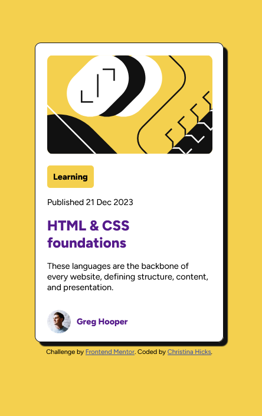

# Frontend Mentor - Blog preview card solution

This is a solution to the [Blog preview card challenge on Frontend Mentor](https://www.frontendmentor.io/challenges/blog-preview-card-ckPaj01IcS). Frontend Mentor challenges help you improve your coding skills by building realistic projects.

## Table of contents

- [Overview](#overview)
  - [The challenge](#the-challenge)
  - [Screenshot](#screenshot)
  - [Links](#links)
- [My process](#my-process)
  - [Built with](#built-with)
  - [What I learned](#what-i-learned)
  - [Continued development](#continued-development)
- [Author](#author)

## Overview

### The challenge

Users should be able to:

- See hover and focus states for all interactive elements on the page

### Screenshot

### Links

- Solution URL: [https://github.com/PTN6389/blog-preview-card](https://github.com/PTN6389/blog-preview-card)
- Live Site URL: [https://ptn6389.github.io/blog-preview-card/](https://ptn6389.github.io/blog-preview-card/)

## My process

### Built with

- Semantic HTML5 markup
- CSS custom properties
- Flexbox

### What I learned

I had the incorrect relative paths to css, images, and fonts, which worked in the 'Open with Live Server'. Once I deployed to the GitHub pages, it did not work in the browsers. So I need to double check my relative paths even if it works in localhost.

### Continued development

With this project I feel more comfortable with CSS Flexbox, but would like to continue practicing.

## Author

- Portfolio Website - [Christina Hicks](https://ptn6389.github.io/portfolio-website/)
- LinkedIn - [LinkedIn](https://www.linkedin.com/in/christinahicks1)
- Frontend Mentor - [@PTN6389](https://www.frontendmentor.io/profile/PTN6389)
